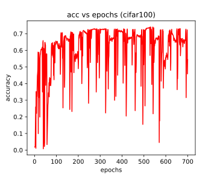

## Nirbhay Sharma (B19CSE114)
## Deep Learning - End sem part - 1

---
### **Introduction**

In the area of deep learning the tuning of hyperparameters is considered as one of the most crucial step in deciding the performance of the deep learning architectures such as CNN, RNN, GAN's, and some of these architectures are so much sensitive to their hyperparameters that a slight change in the values of the hyperparameters would cause a drastic effect on model performance in terms of increasing / decreasing the model performance, and so It becomes very important to decide the hyperparamters like (learning rate, eopchs, optimizer) etc. in a very experienced manner, or other way is to automate the whole process like in case of AUTOML and so there is a requirement of some automation in selecting the hyperparameters to get the best out of the deep learning model, and on the same line the authors of the paper "AutoLRS - Automatic Learning rate schedular by bayesian optimization on the fly", proposed to automate the process of selecting learning rate using bayesian optimization, The bayesian optimization is explained in brief in further section of the report.

### **Bayesian Optimization**

### **Results on cifar10 dataset**

- the results reproduced on the cifar10 dataset are 

|accuracy on paper|accuracy getting after training|
|---|---|
|$94\\%$|$93.79\\%$|

**loss vs iteration, lr(learning rate) vs steps, accuracy vs epochs plots on cifar10 dataset** 

     

### **Results on cifar100 dataset**

- the results reproduced on the cifar100 dataset are 

|accuracy getting after training|
|---|
|$74.04\\%$|

**loss vs iteration, lr(learning rate) vs steps, accuracy vs epochs plots on cifar100 dataset** 

     

---

