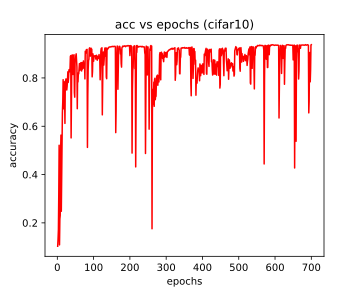

## Nirbhay Sharma (B19CSE114)
## Deep Learning - End sem part - 1

---
### **Introduction**

In the area of deep learning the tuning of hyperparameters is considered as one of the most crucial step in deciding the performance of the deep learning architectures such as CNN, RNN, GAN's, and some of these architectures are so much sensitive to their hyperparameters that a slight change in the values of the hyperparameters would cause a drastic effect on model performance in terms of increasing / decreasing the model performance, and so It becomes very important to decide the hyperparamters like (learning rate, eopchs, optimizer) etc. in a very experienced manner, or other way is to automate the whole process like in case of AUTOML and so there is a requirement of some automation in selecting the hyperparameters to get the best out of the deep learning model, and on the same line the authors of the paper "AutoLRS - Automatic Learning rate schedular by bayesian optimization on the fly", proposed to automate the process of selecting learning rate using bayesian optimization, The bayesian optimization is explained in brief in further section of the report. the code and the log files after training are available at  https://github.com/nirbhay-design/dl-end-sem , the paper is available at https://arxiv.org/pdf/2105.10762.pdf

### **Bayesian Optimization**

While training a Deep Neural Network, the convergence is achieved using gradient descent as follows

$$
\theta_{t+1} = \theta_{t} - \frac{\eta_{t}}{|B_{train}|} \sum_{x \in B_{train}} \triangledown_{\theta} L(x:\theta_{t})
$$

where $\theta$ is the weights and x is the input ($x \in B_{train}$) where $B_{train}$ is training batch and $\eta_{t}$ is the learning rate at instance t, so we are trying to optimize the weights using the standard gradient descent technique and our main target is to minimize the loss function $L(x:\theta)$ and for that we need to learn sequence of lr's as $(\eta_{1},\eta_{2},...,\eta_{T})$ for which our loss is minimized and by minimized we mean to say to minizmize the loss on both train and validation set.

On the same line Bayesian optmization is introduced which is the state-of-the-art techinique for black-box optimization, apart from picking up the learning rate randomly each time or using a set of lr's each time, Bayesian optimization utitlizes previous information as well to discard the values which were not promising and move in the direction where the results were promising and in this way it saves a lot of time by going in the right direction always, basically it learns an aquisition function ($f(\eta)$) using a surrogate function (prior) which is basically a gaussian process, the BO techinique gradually update the posterior of $f(\eta)$ by using it's likelihood and it tries to change the learning rate in order to increase the validation score, Basically BO has 2 main components

1. aquisition/objective function ($f(\eta)$) this function serves as the evaluator of the chosen hyperparameter on the validation set and of course it will take in the data and set of hyperparameters and outputs a score which will tell, how good hyperparameters are on validation set, each time evaluating the function to check validation score is a much computationally costly operation and so the authors of the paper come up with method to test till small iterations $\tau' (<< \tau)$ and in this way they are calling the evaluation function much less time only $\tau'$ time
2. the surrogate function is the another major component in the bayesian optimization technique, as it acts as an light weight assistant to objective function which keeps track of the hyperparameter used so far and so forward those hyperparameters to the objective function for further evaluation, it is used as a prior by the BO technique.

  the BO updates the posterior of the aquisition function using the equation below 

$$
P(\eta/accuracy) = \frac{P(accuracy/\eta) * P(\eta)}{P(accuracy)} 
$$

$$
Posterior = \frac{Likelihood * Prior}{Evidance}
$$

the overall simplified optimization definition is presented below -
- find set of hyperparameters using surrogate function
- pass these hyperparameter to the objective function for validation score
- update the posterior of the aquisition function using bayes theorem

  algorithm for choosing the $\eta_{i+1}$, so we have aquisition function $f(\eta)$ which has mean $\mu({\eta})$ and std deviation $\sigma(\eta)$ net learning rate can be found as 
  
$$
\eta_{new} = arg min_{\eta} f(\eta); f(\eta) = \mu(\eta) - k\sigma(\eta)
$$

  the sample algorithm is also presented below

### **Training pipeline and arrangements**

- the training is done on Titon GTX gpu's with batch_size 128, 700 epochs, SGD optimizer with momentum 0.9, crossentropy loss, and the learning rate is initialized to 0.1, on cifar10 dataset (given in paper) and on cifar100 dataset (explicit dataset not given in paper) 
- the model chosen is vgg16 as mentioned in the paper
- after training, the log files are generated which gives the test accuracy on the test set, below shown the results and the plots of results on cifar10 and cifar100 dataset

### **Results on cifar10 dataset**

- the results reproduced on the cifar10 dataset are 

|accuracy on paper|accuracy getting after training|
|---|---|
|$94.13\\%$|$93.79\\%$|

**loss vs iteration, lr(learning rate) vs steps, accuracy vs epochs plots on cifar10 dataset** 

     

### **Results on cifar100 dataset**

- the results reproduced on the cifar100 dataset are 

|accuracy getting after training|
|---|
|$74.04\\%$|

**loss vs iteration, lr(learning rate) vs steps, accuracy vs epochs plots on cifar100 dataset** 

     

### **Result analysis**

- as mentioned in the paper the results on cifar10 dataset with vgg as the base model is reported to be 94% and the reproduced results are coming to be 93% and the fact here to consider is that the training is really fast, it is done in couple of hours as mentioned in the paper as well and is fast as compared to other learning rate optimization techiniques
- on cifar100 dataset the same vgg as baseline model is used and the accuracy on test set is coming out to be 74.04% which is good as 100 classes and vgg model are concerned
- the loss curve is very fluctuating in both cifar10 and cifar100 but it is decreasing and converging nicely as the optimization techinique optimize the learning rate and the accuray also has an increasing curve with some fluctuations due to the changes in learning rate but the end result is converged.

**References**

1.  https://medium.com/vantageai/bringing-back-the-time-spent-on-hyperparameter-tuning-with-bayesian-optimisation-2e21a3198afb 
2. https://arxiv.org/pdf/2105.10762.pdf

---

